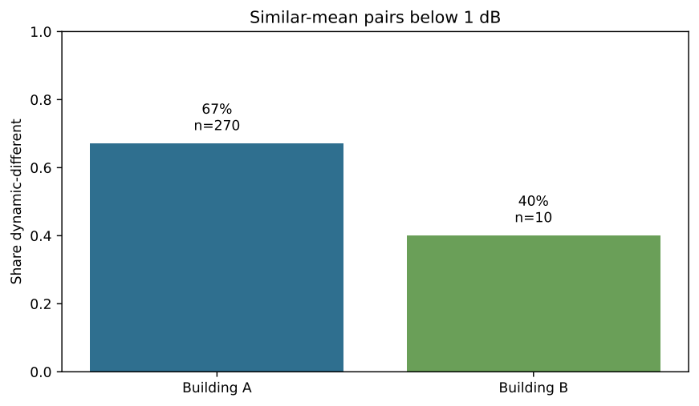
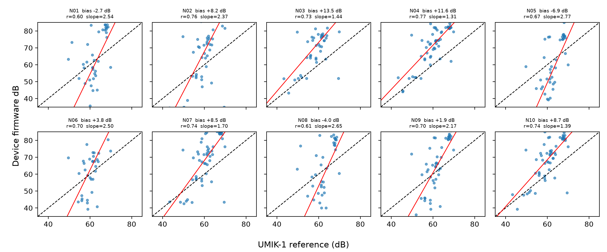

# Acoustic Exposure Dynamics Dataset

[](LICENSE.md)
[](https://doi.org/10.5281/zenodo.21503880)

An anonymized, privacy-oriented companion dataset for studying distributed
dB-only sound-level dynamics in occupied office buildings. It accompanies the
manuscript *"Distributed Privacy-Oriented dB-Only Monitoring Reveals
Operational Acoustic Dynamics in Occupied Office Buildings."*

The repository contains aggregate features, mixed-effects outputs,
cross-deployment comparisons, two uncontrolled device-versus-reference
co-locations, secondary archived-data analyses, and publication figures. It
contains no raw audio, raw high-frequency deployment logs, exact calendar
times, hardware identifiers, customer names, team labels, original floor
labels, or labeled floor-plan images.

## Release status

- Current archived release: `v1.1.0`
- GitHub `main`: privacy-corrected ten-device update prepared for the next release
- Concept DOI: [10.5281/zenodo.21503880](https://doi.org/10.5281/zenodo.21503880)
- Release history: [`RELEASE_NOTES.md`](RELEASE_NOTES.md)

## Dataset snapshot

| Item | Public description |
|---|---|
| Main deployment | `Deployment_A`: 56 pseudonymized nodes across five anonymized floors |
| Secondary deployment | `Deployment_B`: 13 pseudonymized nodes on one anonymized floor |
| Underlying records | 185,140,775 in Deployment A; 24,393,582 in Deployment B |
| Signal | Firmware-reported SPL-like dB values derived from 5 ms RMS windows |
| Reference checks | One single-device and one ten-device uncontrolled UMIK-1 co-location |
| Public data level | Aggregate and anonymized derived data only |

`SPL-like` means firmware-reported sound-level values. It does not mean
IEC-certified sound-level-meter output or formal A-weighted equivalent level.

## System architecture and selected manuscript figures

<p align="center">
  
</p>

<p align="center"><em>System-level data flow and privacy boundary. The public
release contains aggregate feature outputs, not raw audio, speech content, or
source labels.</em></p>

The architecture label describing calibrated nodes refers to the deployed
firmware workflow. It does not establish IEC 61672 conformity, formal
A-weighting, frequency-response flatness, or valid absolute-threshold
interpretation.

<p align="center">
  
</p>

<p align="center"><em>Selected cross-deployment results. Deployment B provides
limited directional replication for compatible contrasts; it is not an
independent metrological validation.</em></p>

<table>
  <tr>
    <td width="50%">
      
    </td>
    <td width="50%">
      
    </td>
  </tr>
  <tr>
    <td><strong>Mean insufficiency.</strong> Sensor pairs within 1 dB can still
    differ in quiet share, high-level share, or variability.</td>
    <td><strong>Device variability.</strong> The uncontrolled ambient
    co-location reveals substantial unit-to-unit spread and motivates
    controlled calibration.</td>
  </tr>
</table>

Additional publication figures are available under
[`figures/manuscript/`](figures/manuscript/).

## Repository structure

```text
data/
  metadata/
  processed/
    main_deployment/
    validation_deployment/
    cross_deployment/
    calibration_validation/
docs/
figures/
  manuscript/
```

The `calibration_validation` directory includes:

- the archived single-device UMIK-1 comparison;
- the ten-device ambient co-location with timestamps and hardware IDs removed;
- device-cluster bootstrap intervals;
- a within-session chronological holdout check; and
- transfer of the historical single-device correction to the ten-device session.

## Scientific boundaries

The dataset supports operational acoustic observability, not standardized
room-acoustic characterization or compliance measurement. It cannot establish
IEC 61672 conformity, formal A-weighting, frequency-response flatness, RT60,
speech transmission index, speech privacy, source identity, occupancy counts,
or causal operational effects.

Event categories are operational case observations rather than replicated
interventions. The reference comparisons are real but uncontrolled,
ambient-stimulus sessions. They do not replace a controlled multi-device,
multi-level calibration and frequency-response campaign.

## How to use

1. Read [`data/metadata/public_manifest.json`](data/metadata/public_manifest.json).
2. Use [`data/metadata/data_dictionary.md`](data/metadata/data_dictionary.md) to interpret fields.
3. Read [`docs/privacy_and_limitations.md`](docs/privacy_and_limitations.md) before drawing conclusions.
4. Load the CSV files under `data/processed/` for aggregate analysis.

## Citation

> Mansournia, P. (2026). Acoustic Exposure Dynamics Dataset: Anonymized
> dB-only office sound-level features for privacy-oriented acoustic monitoring
> research (v1.1.0). Zenodo. https://doi.org/10.5281/zenodo.21503880

See [`CITATION.cff`](CITATION.cff) for machine-readable metadata.

## License

The public aggregate dataset and documentation are released under
[CC BY 4.0](LICENSE.md). Private raw data and non-public deployment materials
are outside the scope of this license.

## Contact

For questions, contact Pouya Mansournia or open a GitHub issue.
