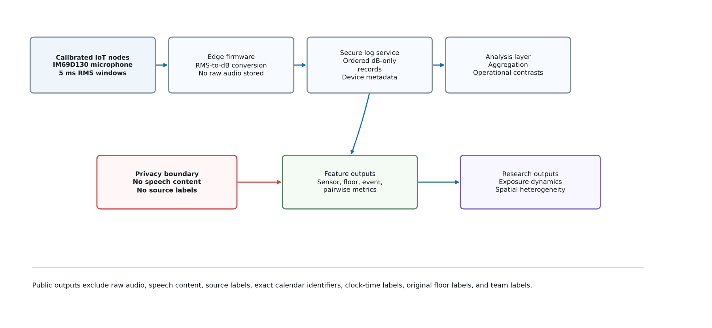
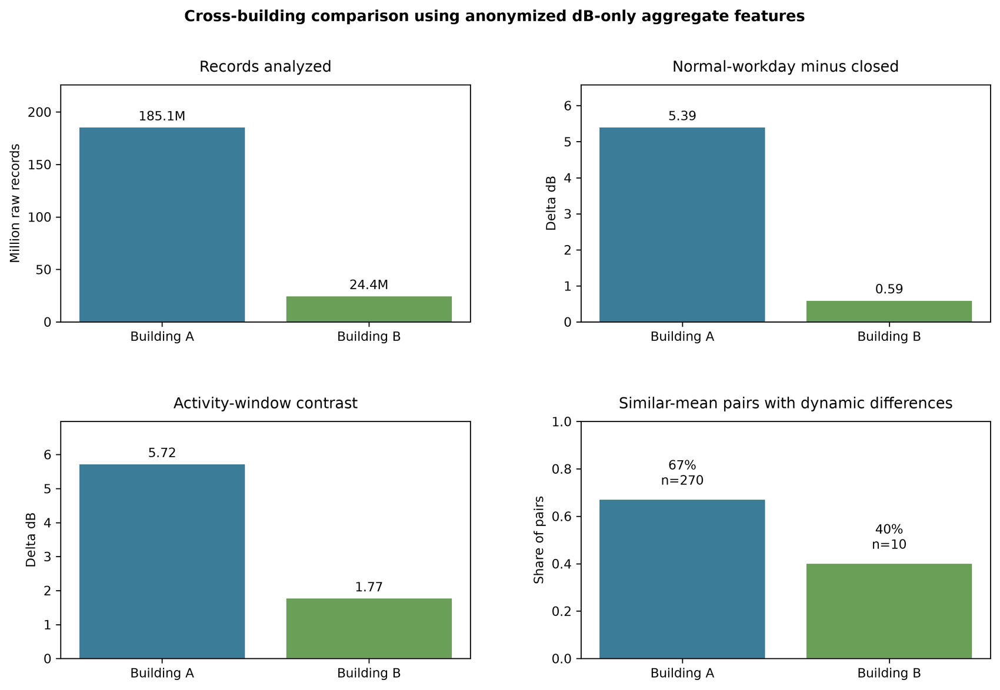

# Acoustic Exposure Dynamics Dataset

[](LICENSE.md)
[](https://doi.org/10.5281/zenodo.21503880)

An anonymized, privacy-preserving companion dataset for studying long-term, distributed dB-only acoustic exposure dynamics in occupied office buildings. It is the public data release accompanying the manuscript *"Privacy-Preserving Long-Term Acoustic Exposure Dynamics in an Occupied Multi-Floor Office Building Using Distributed dB-Only IoT Monitoring."*

The dataset contains aggregate feature tables, mixed-effects model outputs, cross-deployment validation summaries, a real device-vs-reference-microphone calibration check, and publication figures. It does **not** contain raw audio, raw high-frequency sound logs, exact calendar dates, clock times, customer names, team labels, original floor labels, or labeled floor-plan images.

## Table of Contents

- [Release Status](#release-status)
- [Dataset Snapshot](#dataset-snapshot)
- [Pilot Overview](#pilot-overview)
- [What Is Included](#what-is-included)
- [Key Use Cases](#key-use-cases)
- [Scientific Boundaries](#scientific-boundaries)
- [Repository Structure](#repository-structure)
- [How To Use](#how-to-use)
- [Citation](#citation)
- [Zenodo Archiving](#zenodo-archiving)
- [License](#license)
- [Contact](#contact)

## Release Status

- Current release: `v1.1.0`, archived on GitHub and Zenodo
- See [`RELEASE_NOTES.md`](RELEASE_NOTES.md) for the full version history
- GitHub repository: <https://github.com/Pouya-Mansournia/acoustic-exposure-dynamics-dataset>
- Zenodo DOI: [10.5281/zenodo.21503880](https://doi.org/10.5281/zenodo.21503880)
- Project type: scholarly dataset and manuscript companion material

## Dataset Snapshot

| Item | Public description |
|---|---|
| Main deployment | `Deployment_A`: 56 pseudonymized nodes across five anonymized floors |
| Validation deployment | `Deployment_B`: 13 pseudonymized nodes on one anonymized floor |
| Underlying records | 185,140,775 in Deployment A; 24,393,582 in Deployment B |
| Signal | Calibrated SPL-like dB values derived from 5 ms RMS windows |
| Calibration check | One in-situ session, one device vs. a UMIK-1 reference microphone: r = 0.87, mean bias +8.64 dB |
| Raw audio | Not stored and not released |
| Public data level | Aggregate features, summaries, model outputs, and figures |

`SPL-like` means device-calibrated sound-level values derived from deployed firmware. It should not be interpreted as IEC-certified sound-level-meter output.

## Pilot Overview





## What Is Included

- **`data/processed/main_deployment/`** — Deployment A aggregate features, pairwise metrics, mixed-effects outputs, and sensitivity analyses.
- **`data/processed/validation_deployment/`** — Deployment B aggregate validation features.
- **`data/processed/cross_deployment/`** — Cross-deployment replication summaries.
- **`data/processed/calibration_validation/`** — A single continuous, unscripted in-situ co-location session between one Acust device and a calibrated miniDSP UMIK-1 reference microphone, time-aligned to 1-second bins by cross-correlation (r = 0.87, mean bias +8.64 dB, RMSE 10.15 dB; see [`docs/privacy_and_limitations.md`](docs/privacy_and_limitations.md) for full scope and caveats).
- **`data/metadata/`** — Public manifest, data dictionary, and pseudonymized sensor keys.
- **`figures/manuscript/`** — Publication-ready, anonymized manuscript figures.
- **`docs/`** — Methodology notes and privacy/limitations documentation.

## Key Use Cases

- Long-term office acoustic exposure analysis.
- Privacy-preserving acoustic monitoring research.
- Operational-regime comparison across workday, closed-day, and activity-window conditions.
- Testing whether average dB hides variability, high-exposure share, and quiet-period differences.
- Studying device-level calibration accuracy against a reference measurement microphone.
- Reproducing the public model, sensitivity, and validation outputs reported in the manuscript.

## Scientific Boundaries

This dataset supports operational acoustic observability, not standardized room-acoustic characterization or certified sound-level-meter compliance measurement. It cannot support claims about RT60, T20/T30, room impulse responses, absorption coefficients, speech content, sound-source identity, exact occupancy counts, speech transmission index (STI), or physical propagation time between nodes.

Event-level categories (closed days, low-attendance periods, broad remote-work periods) are operational case observations rather than statistically replicated interventions. The calibration-validation data is a single-device, single-session, ambient-stimulus check — real and timestamped, but not a substitute for a controlled, multi-device, multi-level laboratory calibration campaign.

## Repository Structure

```text
data/
  metadata/
    public_manifest.json
    data_dictionary.md
    main_sensor_key_public.csv
    validation_sensor_key_public.csv
  processed/
    main_deployment/
    validation_deployment/
    cross_deployment/
    calibration_validation/
figures/
  manuscript/
docs/
  methodology_notes.md
  privacy_and_limitations.md
```

## How To Use

1. Start with [`data/metadata/public_manifest.json`](data/metadata/public_manifest.json) for the release inventory and privacy transform.
2. Use [`data/metadata/data_dictionary.md`](data/metadata/data_dictionary.md) to interpret public fields, including the calibration-validation columns.
3. Load the CSV files under `data/processed/` for aggregate analysis, model review, or manuscript reproduction.
4. Read [`docs/methodology_notes.md`](docs/methodology_notes.md) and [`docs/privacy_and_limitations.md`](docs/privacy_and_limitations.md) before drawing conclusions from any table — they state what each metric does and does not represent.
5. Use the figures under `figures/manuscript/` as public, anonymized visual summaries.

## Citation

If you use this dataset, cite this repository and the associated manuscript when available:

> Mansournia, P. (2026). Acoustic Exposure Dynamics Dataset: Anonymized long-term dB-only office sound-level features for privacy-preserving acoustic monitoring research (v1.1.0). Zenodo. https://doi.org/10.5281/zenodo.21503880

See [`CITATION.cff`](CITATION.cff) for machine-readable citation metadata.

## Zenodo Archiving

This repository is archived on Zenodo:

- Concept DOI (always resolves to the latest version): [10.5281/zenodo.21503880](https://doi.org/10.5281/zenodo.21503880)
- GitHub releases: <https://github.com/Pouya-Mansournia/acoustic-exposure-dynamics-dataset/releases>
- Zenodo metadata source: [`.zenodo.json`](.zenodo.json)

## License

The public aggregate dataset and documentation are released under the [Creative Commons Attribution 4.0 International License](LICENSE.md).

Private raw data, raw logs, customer metadata, and any non-public deployment materials are not included in this release and are not licensed by this repository.

## Contact

For questions about this dataset, the associated manuscript, or requests for additional (privacy-reviewed) analysis code, contact the corresponding author, Pouya Mansournia, or open an issue in this repository.
