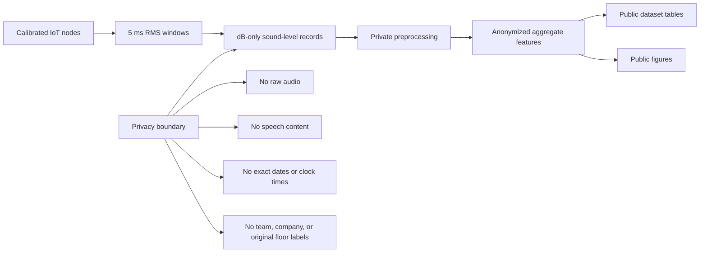

# Acoustic Exposure Dynamics Dataset

An anonymized collection of long-term dB-only office sound-level feature tables and analysis outputs for studying privacy-preserving acoustic exposure dynamics in occupied office deployments.

This repository is the public companion dataset for a manuscript on distributed dB-only acoustic monitoring. It contains anonymized aggregate feature tables, model outputs, cross-deployment validation summaries, and manuscript figures. It intentionally does not include raw audio, speech content, raw high-frequency logs, exact calendar dates, clock times, customer names, team labels, original floor labels, or labeled floor-plan images.

## What This Repository Contains

- `Deployment_A`: the main anonymized multi-floor office deployment.
- `Deployment_B`: an independent anonymized one-floor validation deployment.
- Cross-deployment summaries used for external validation.
- Mixed-effects model outputs and sensitivity analyses.
- Public figures derived from anonymized aggregate data.
- Metadata, data dictionary, methodology notes, and privacy limitations.

## What This Repository Does Not Contain

- Raw audio.
- Raw sound logs.
- Exact calendar dates, weekday labels, or clock times.
- Names of teams, people, customers, companies, or original floor-plan labels.
- RT60, T20/T30, impulse responses, or sound-source labels.
- CO2, temperature, humidity, or light measurements.

## Underlying Study Summary

- Deployment A: 185,140,775 underlying dB-only records from 56 pseudonymized nodes across five anonymized floors.
- Deployment B: 24,393,582 underlying dB-only records from 13 pseudonymized nodes on one anonymized floor.
- Signal: calibrated SPL-like dB values derived from 5 ms RMS windows.
- Raw audio: not stored.

Throughout this repository, `SPL-like` means device-calibrated sound-level values derived from deployed firmware. It should not be interpreted as IEC-certified sound-level-meter output.

## Key Aggregate Findings

- Normal-workday sound levels were higher than closed-day levels in both deployments under the primary arithmetic summary.
- The main activity window was higher than other periods in both deployments.
- Low-attendance and broad remote-work categories in Deployment A are operational case observations, not statistically replicated interventions.
- Similar mean dB values can hide different high-exposure share, quiet-share, and variability profiles.
- Approximate geometric distance alone weakly explained pairwise daily synchrony in Deployment A.

## Processing Overview



## Repository Structure

```text
data/
  metadata/
    public_manifest.json
    main_sensor_key_public.csv
    validation_sensor_key_public.csv
    data_dictionary.md
  processed/
    main_deployment/
    validation_deployment/
    cross_deployment/
figures/
  manuscript/
docs/
  methodology_notes.md
  privacy_and_limitations.md
```

## Scientific Boundaries

This dataset contains sound-level aggregates and features, not raw audio. Therefore it cannot support claims about RT60, T20, T30, room impulse responses, absorption coefficients, speech content, source identity, exact occupancy counts, or physical propagation time between nodes.

The objective is not to replace standardized acoustic room characterization, but to complement it with continuous privacy-preserving operational observability.

## Suggested Citation

Mansournia, P. et al. Acoustic Exposure Dynamics Dataset: Anonymized long-term dB-only office sound-level features for privacy-preserving acoustic monitoring research. GitHub repository.

## License

No explicit reuse license has been granted yet. Please contact the repository owner before using the data in publications or derivative datasets.
